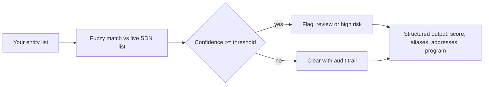

# OFAC Sanctions Screening API — Batch SDN Screening for KYC and AML


[](https://apify.com/george.the.developer/ofac-sanctions-screener)
[](https://sanctionssearch.ofac.treas.gov/)
[](https://apify.com/george.the.developer/ofac-sanctions-screener)
[](https://mcp.apify.com)

Screen any list of companies, people, or vessels against the live US Treasury OFAC SDN sanctions list and get back match confidence, risk level, aliases, and addresses. Built for compliance teams, fintech onboarding, and import or export due diligence. Runs as a batch API and inside AI agents over MCP.

If you onboard customers, pay vendors, or move money across a border, OFAC screening is not optional. This turns that obligation into a single call over a whole list, with the data behind every hit so an analyst clears or escalates in seconds.

**Run it here:** https://apify.com/george.the.developer/ofac-sanctions-screener

## Screen a vendor list in 20 minutes

1. Drop your list of names into the input, one entity per row.
2. Run it. Each name is matched against the current SDN list with fuzzy matching, so "Ivan Petrov" still catches "Ivan Petroff."
3. Read the output. Every row returns a match confidence score, the matched SDN entry, known aliases, listed addresses, and a risk level.
4. Filter to anything above your threshold. Those are the rows a human reviews. Everything else is cleared with an audit trail.

A full first pass screening of hundreds of counterparties in the time it took to check five by hand.

## Input

```json
{
  "entities": ["Acme Trading LLC", "Ivan Petrov", "MV Northern Star"],
  "minConfidence": 80
}
```

## Output per entity

| Field | Meaning |
|---|---|
| match_confidence | 0 to 100 fuzzy match score against the SDN entry |
| risk_level | clear, review, or high |
| matched_name | the exact SDN list entry that triggered the match |
| aliases | known alternate names for the sanctioned entity |
| addresses | listed addresses for the match |
| program | the sanctions program the entry falls under |

## Use it inside Claude or any AI agent (MCP)

The actor is exposed over the Apify MCP server, so an AI agent can screen entities mid conversation with no glue code:

```
https://mcp.apify.com?tools=george.the.developer/ofac-sanctions-screener
```

Ask your agent "screen these twelve vendors against OFAC and flag anything over 85 percent" and it runs the actor, reads the matches, and hands you the shortlist. Real compliance work done inside the chat.

## How it works



The actor pulls the current OFAC SDN data, runs each input name through fuzzy matching against primary names and aliases, scores every candidate, and returns a clean record per entity. No login, no manual list downloads, no stale data.

## Who uses this

- Fintech and payments teams screening customers at onboarding for KYC and AML
- Import and export businesses checking counterparties before a deal closes
- Banks and lenders re-screening their book on a schedule
- Compliance consultants delivering due diligence reports
- AI agents that need a sanctions check as one step in a larger workflow

## Note on compliance

This gives you a fast, auditable first pass screening against the OFAC SDN list. Final compliance decisions stay with your team, since you know your own risk policy. The technical screening is solid and the data current.

---

Built by George. More data and compliance tools: https://apify.com/george.the.developer
